# 📊 Diagrammes UML Visuels - Projet AllInOne

Ce document complète le tutoriel UML principal avec des diagrammes au format Mermaid, optimisés pour la visualisation dans les éditeurs Markdown modernes (VS Code, GitHub, GitLab, etc.).

## Table des Matières
1. [Diagramme de Classes Principal](#1-diagramme-de-classes-principal)
2. [Architecture des Renderers](#2-architecture-des-renderers)
3. [Système de Plugins](#3-système-de-plugins)
4. [Diagrammes de Séquence](#4-diagrammes-de-séquence)
5. [Patterns de Conception](#5-patterns-de-conception)

---

## 1. Diagramme de Classes Principal

### Vue d'ensemble de l'architecture

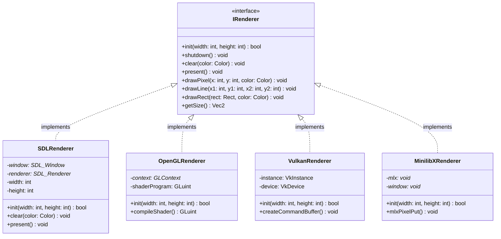
```mermaid
classDiagram
    class IRenderer {
        <<interface>>
        +init(width: int, height: int) bool
        +shutdown() void
        +clear(color: Color) void
        +present() void
        +drawPixel(x: int, y: int, color: Color) void
        +drawLine(x1: int, y1: int, x2: int, y2: int) void
        +drawRect(rect: Rect, color: Color) void
        +getSize() Vec2
    }
    
    class SDLRenderer {
        -window: SDL_Window*
        -renderer: SDL_Renderer*
        -width: int
        -height: int
        +init(width: int, height: int) bool
        +clear(color: Color) void
        +present() void
    }
    
    class OpenGLRenderer {
        -context: GLContext*
        -shaderProgram: GLuint
        +init(width: int, height: int) bool
        +compileShader() GLuint
    }
    
    class VulkanRenderer {
        -instance: VkInstance
        -device: VkDevice
        +init(width: int, height: int) bool
        +createCommandBuffer() void
    }
    
    class MinilibXRenderer {
        -mlx: void*
        -window: void*
        +init(width: int, height: int) bool
        +mlxPixelPut() void
    }
    
    IRenderer <|.. SDLRenderer : implements
    IRenderer <|.. OpenGLRenderer : implements
    IRenderer <|.. VulkanRenderer : implements
    IRenderer <|.. MinilibXRenderer : implements
```

### Application Core

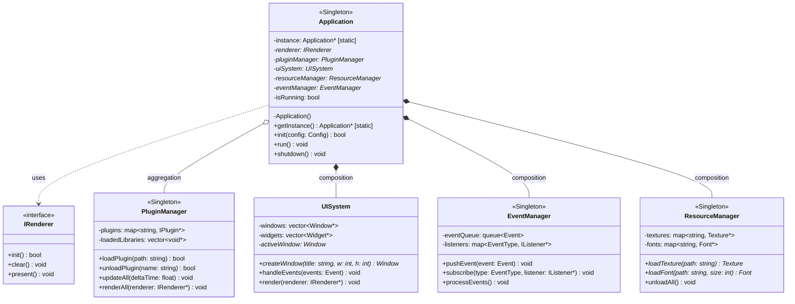
```mermaid
classDiagram
    class Application {
        <<Singleton>>
        -instance: Application* [static]
        -renderer: IRenderer*
        -pluginManager: PluginManager*
        -uiSystem: UISystem*
        -resourceManager: ResourceManager*
        -eventManager: EventManager*
        -isRunning: bool
        -Application()
        +getInstance() Application* [static]
        +init(config: Config) bool
        +run() void
        +shutdown() void
    }
    
    class IRenderer {
        <<interface>>
        +init() bool
        +clear() void
        +present() void
    }
    
    class PluginManager {
        <<Singleton>>
        -plugins: map~string, IPlugin*~
        -loadedLibraries: vector~void*~
        +loadPlugin(path: string) bool
        +unloadPlugin(name: string) bool
        +updateAll(deltaTime: float) void
        +renderAll(renderer: IRenderer*) void
    }
    
    class UISystem {
        -windows: vector~Window*~
        -widgets: vector~Widget*~
        -activeWindow: Window*
        +createWindow(title: string, w: int, h: int) Window*
        +handleEvents(events: Event) void
        +render(renderer: IRenderer*) void
    }
    
    class EventManager {
        <<Singleton>>
        -eventQueue: queue~Event~
        -listeners: map~EventType, IListener*~
        +pushEvent(event: Event) void
        +subscribe(type: EventType, listener: IListener*) void
        +processEvents() void
    }
    
    class ResourceManager {
        <<Singleton>>
        -textures: map~string, Texture*~
        -fonts: map~string, Font*~
        +loadTexture(path: string) Texture*
        +loadFont(path: string, size: int) Font*
        +unloadAll() void
    }
    
    Application ..> IRenderer : uses
    Application o-- PluginManager : aggregation
    Application *-- UISystem : composition
    Application *-- EventManager : composition
    Application *-- ResourceManager : composition
```

---

## 2. Architecture des Renderers

### Hiérarchie complète

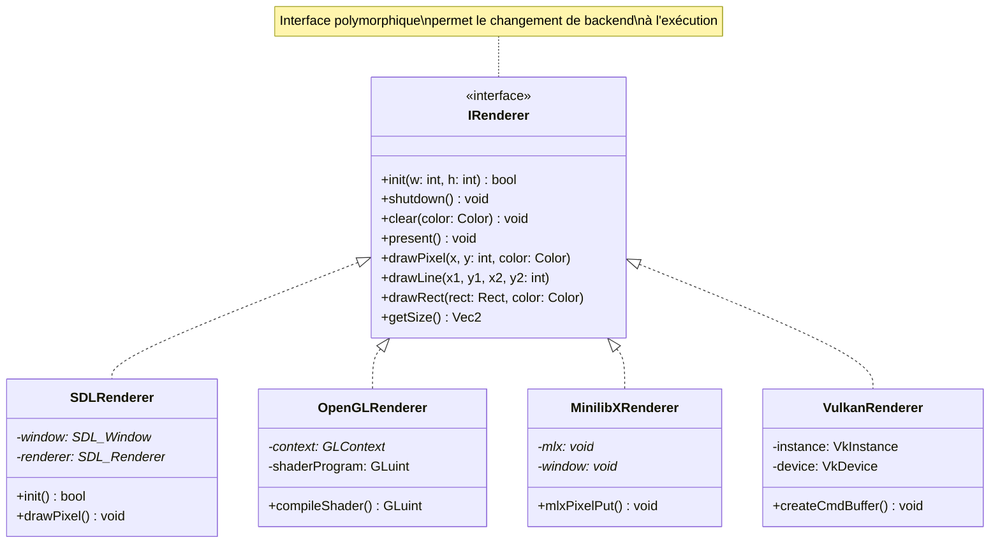
```mermaid
classDiagram
    class IRenderer {
        <<interface>>
        +init(w: int, h: int) bool
        +shutdown() void
        +clear(color: Color) void
        +present() void
        +drawPixel(x, y: int, color: Color)
        +drawLine(x1, y1, x2, y2: int)
        +drawRect(rect: Rect, color: Color)
        +getSize() Vec2
    }
    
    class SDLRenderer {
        -window: SDL_Window*
        -renderer: SDL_Renderer*
        +init() bool
        +drawPixel() void
    }
    
    class OpenGLRenderer {
        -context: GLContext*
        -shaderProgram: GLuint
        +compileShader() GLuint
    }
    
    class MinilibXRenderer {
        -mlx: void*
        -window: void*
        +mlxPixelPut() void
    }
    
    class VulkanRenderer {
        -instance: VkInstance
        -device: VkDevice
        +createCmdBuffer() void
    }
    
    IRenderer <|.. SDLRenderer
    IRenderer <|.. OpenGLRenderer
    IRenderer <|.. MinilibXRenderer
    IRenderer <|.. VulkanRenderer
    
    note for IRenderer "Interface polymorphique\npermet le changement de backend\nà l'exécution"
```

---

## 3. Système de Plugins

### Architecture des Plugins

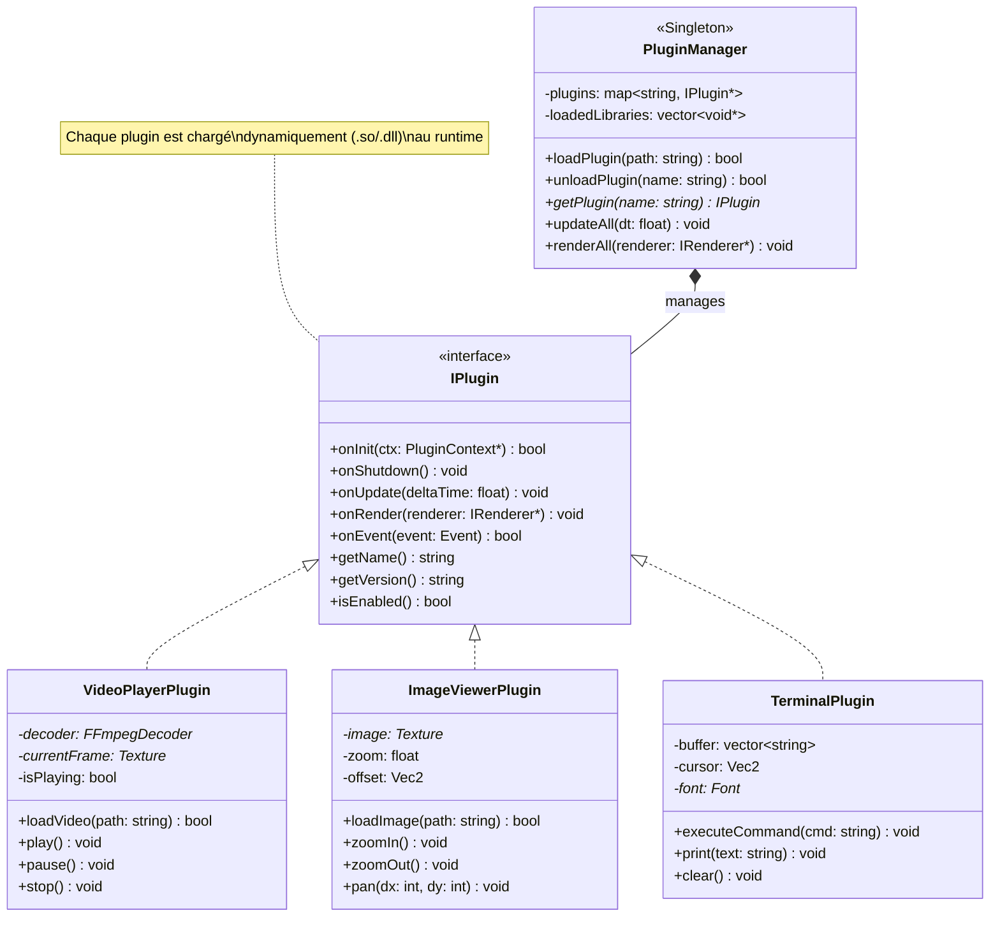
```mermaid
classDiagram
    class IPlugin {
        <<interface>>
        +onInit(ctx: PluginContext*) bool
        +onShutdown() void
        +onUpdate(deltaTime: float) void
        +onRender(renderer: IRenderer*) void
        +onEvent(event: Event) bool
        +getName() string
        +getVersion() string
        +isEnabled() bool
    }
    
    class VideoPlayerPlugin {
        -decoder: FFmpegDecoder*
        -currentFrame: Texture*
        -isPlaying: bool
        +loadVideo(path: string) bool
        +play() void
        +pause() void
        +stop() void
    }
    
    class ImageViewerPlugin {
        -image: Texture*
        -zoom: float
        -offset: Vec2
        +loadImage(path: string) bool
        +zoomIn() void
        +zoomOut() void
        +pan(dx: int, dy: int) void
    }
    
    class TerminalPlugin {
        -buffer: vector~string~
        -cursor: Vec2
        -font: Font*
        +executeCommand(cmd: string) void
        +print(text: string) void
        +clear() void
    }
    
    class PluginManager {
        <<Singleton>>
        -plugins: map~string, IPlugin*~
        -loadedLibraries: vector~void*~
        +loadPlugin(path: string) bool
        +unloadPlugin(name: string) bool
        +getPlugin(name: string) IPlugin*
        +updateAll(dt: float) void
        +renderAll(renderer: IRenderer*) void
    }
    
    IPlugin <|.. VideoPlayerPlugin
    IPlugin <|.. ImageViewerPlugin
    IPlugin <|.. TerminalPlugin
    PluginManager *-- IPlugin : manages
    
    note for IPlugin "Chaque plugin est chargé\ndynamiquement (.so/.dll)\nau runtime"
```

### Contexte du Plugin

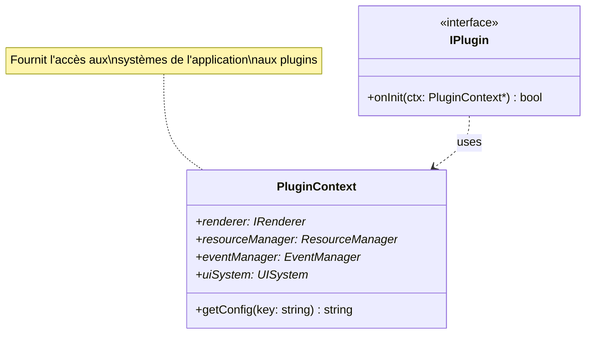
```mermaid
classDiagram
    class PluginContext {
        +renderer: IRenderer*
        +resourceManager: ResourceManager*
        +eventManager: EventManager*
        +uiSystem: UISystem*
        +getConfig(key: string) string
    }
    
    class IPlugin {
        <<interface>>
        +onInit(ctx: PluginContext*) bool
    }
    
    IPlugin ..> PluginContext : uses
    
    note for PluginContext "Fournit l'accès aux\nsystèmes de l'application\naux plugins"
```

---

## 4. Diagrammes de Séquence

### Séquence d'initialisation

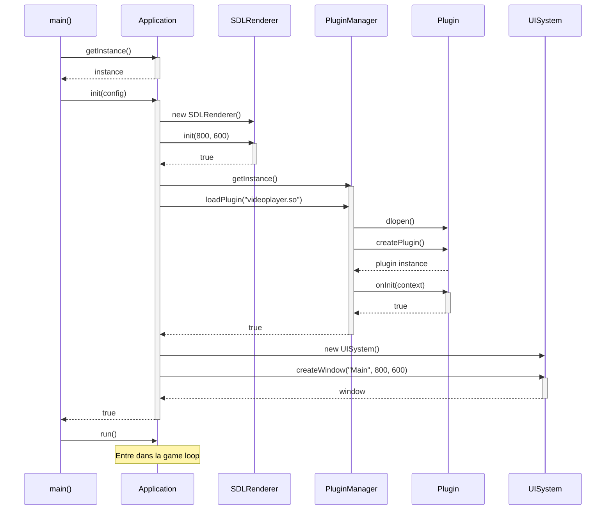
```mermaid
sequenceDiagram
    participant M as main()
    participant A as Application
    participant R as SDLRenderer
    participant PM as PluginManager
    participant P as Plugin
    participant UI as UISystem
    
    M->>A: getInstance()
    activate A
    A-->>M: instance
    deactivate A
    
    M->>A: init(config)
    activate A
    
    A->>R: new SDLRenderer()
    A->>R: init(800, 600)
    activate R
    R-->>A: true
    deactivate R
    
    A->>PM: getInstance()
    activate PM
    A->>PM: loadPlugin("videoplayer.so")
    PM->>P: dlopen()
    PM->>P: createPlugin()
    P-->>PM: plugin instance
    PM->>P: onInit(context)
    activate P
    P-->>PM: true
    deactivate P
    PM-->>A: true
    deactivate PM
    
    A->>UI: new UISystem()
    A->>UI: createWindow("Main", 800, 600)
    activate UI
    UI-->>A: window
    deactivate UI
    
    A-->>M: true
    deactivate A
    
    M->>A: run()
    Note over A: Entre dans la game loop
```

### Game Loop - Cycle de vie

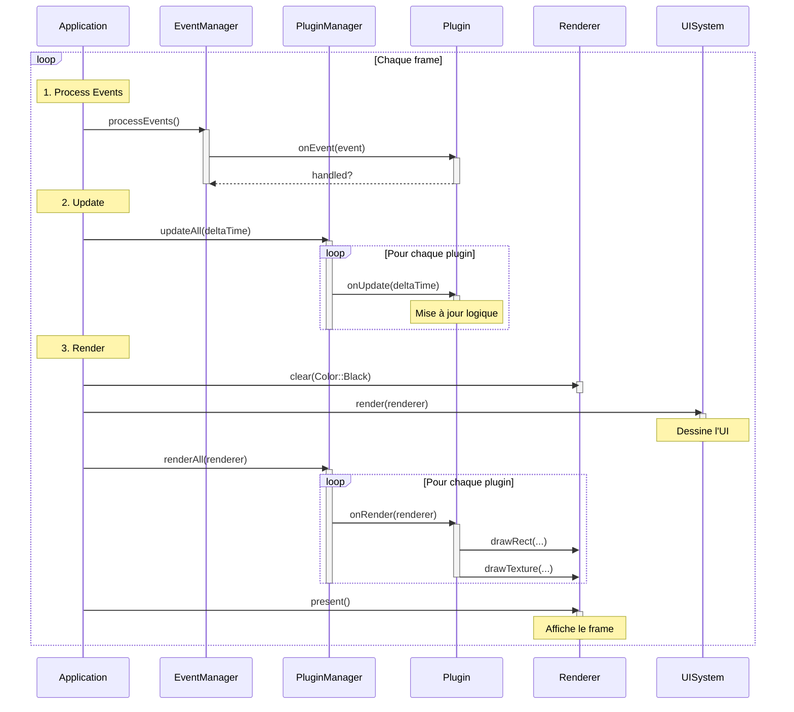
```mermaid
sequenceDiagram
    participant A as Application
    participant EM as EventManager
    participant PM as PluginManager
    participant P as Plugin
    participant R as Renderer
    participant UI as UISystem
    
    loop Chaque frame
        Note over A: 1. Process Events
        A->>EM: processEvents()
        activate EM
        EM->>P: onEvent(event)
        activate P
        P-->>EM: handled?
        deactivate P
        deactivate EM
        
        Note over A: 2. Update
        A->>PM: updateAll(deltaTime)
        activate PM
        loop Pour chaque plugin
            PM->>P: onUpdate(deltaTime)
            activate P
            Note over P: Mise à jour logique
            deactivate P
        end
        deactivate PM
        
        Note over A: 3. Render
        A->>R: clear(Color::Black)
        activate R
        deactivate R
        
        A->>UI: render(renderer)
        activate UI
        Note over UI: Dessine l'UI
        deactivate UI
        
        A->>PM: renderAll(renderer)
        activate PM
        loop Pour chaque plugin
            PM->>P: onRender(renderer)
            activate P
            P->>R: drawRect(...)
            P->>R: drawTexture(...)
            deactivate P
        end
        deactivate PM
        
        A->>R: present()
        activate R
        Note over R: Affiche le frame
        deactivate R
    end
```

### Chargement d'un Plugin

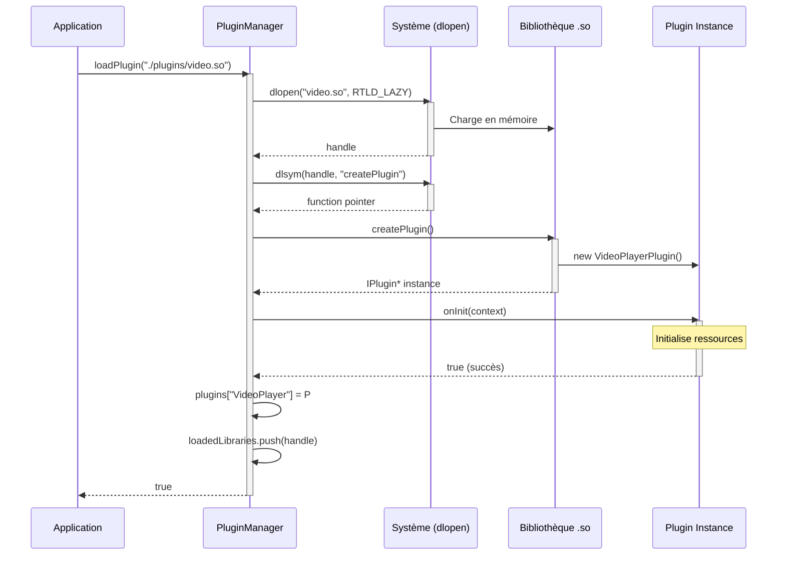
```mermaid
sequenceDiagram
    participant App as Application
    participant PM as PluginManager
    participant OS as Système (dlopen)
    participant Lib as Bibliothèque .so
    participant P as Plugin Instance
    
    App->>PM: loadPlugin("./plugins/video.so")
    activate PM
    
    PM->>OS: dlopen("video.so", RTLD_LAZY)
    activate OS
    OS->>Lib: Charge en mémoire
    OS-->>PM: handle
    deactivate OS
    
    PM->>OS: dlsym(handle, "createPlugin")
    activate OS
    OS-->>PM: function pointer
    deactivate OS
    
    PM->>Lib: createPlugin()
    activate Lib
    Lib->>P: new VideoPlayerPlugin()
    Lib-->>PM: IPlugin* instance
    deactivate Lib
    
    PM->>P: onInit(context)
    activate P
    Note over P: Initialise ressources
    P-->>PM: true (succès)
    deactivate P
    
    PM->>PM: plugins["VideoPlayer"] = P
    PM->>PM: loadedLibraries.push(handle)
    
    PM-->>App: true
    deactivate PM
```

### Gestion d'événements

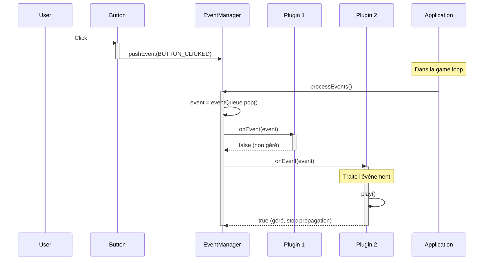
```mermaid
sequenceDiagram
    participant U as User
    participant B as Button
    participant EM as EventManager
    participant P1 as Plugin 1
    participant P2 as Plugin 2
    participant A as Application
    
    U->>B: Click
    activate B
    B->>EM: pushEvent(BUTTON_CLICKED)
    deactivate B
    
    Note over A: Dans la game loop
    A->>EM: processEvents()
    activate EM
    
    EM->>EM: event = eventQueue.pop()
    
    EM->>P1: onEvent(event)
    activate P1
    P1-->>EM: false (non géré)
    deactivate P1
    
    EM->>P2: onEvent(event)
    activate P2
    Note over P2: Traite l'événement
    P2->>P2: play()
    P2-->>EM: true (géré, stop propagation)
    deactivate P2
    
    deactivate EM
```

---

## 5. Patterns de Conception

### Singleton Pattern

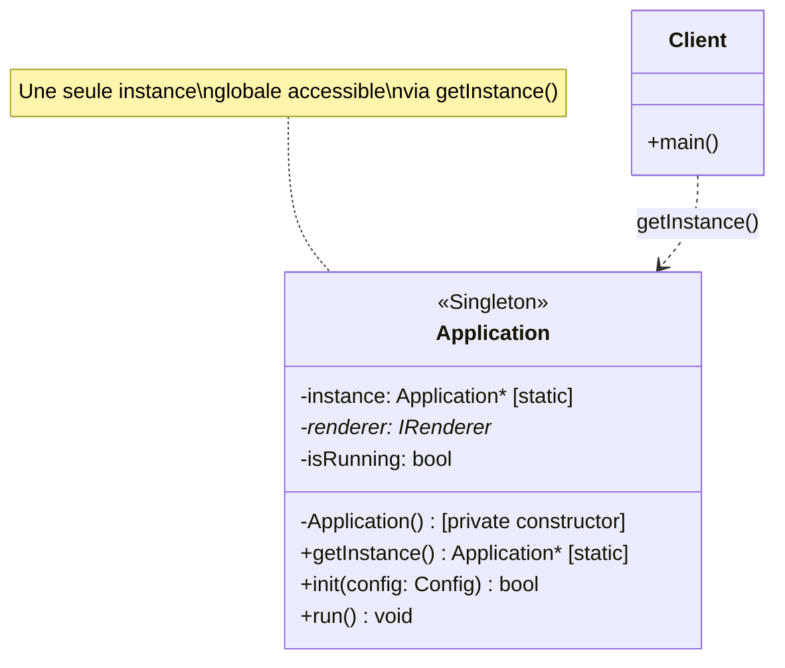
```mermaid
classDiagram
    class Application {
        <<Singleton>>
        -instance: Application* [static]
        -renderer: IRenderer*
        -isRunning: bool
        -Application() [private constructor]
        +getInstance() Application* [static]
        +init(config: Config) bool
        +run() void
    }
    
    class Client {
        +main()
    }
    
    Client ..> Application : getInstance()
    
    note for Application "Une seule instance\nglobale accessible\nvia getInstance()"
```

### Strategy Pattern

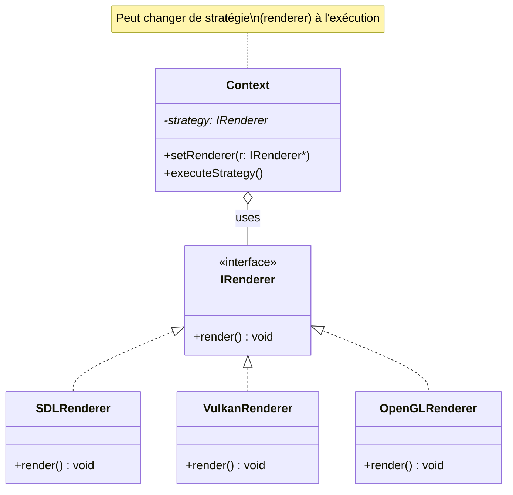
```mermaid
classDiagram
    class Context {
        -strategy: IRenderer*
        +setRenderer(r: IRenderer*)
        +executeStrategy()
    }
    
    class IRenderer {
        <<interface>>
        +render() void
    }
    
    class SDLRenderer {
        +render() void
    }
    
    class VulkanRenderer {
        +render() void
    }
    
    class OpenGLRenderer {
        +render() void
    }
    
    Context o-- IRenderer : uses
    IRenderer <|.. SDLRenderer
    IRenderer <|.. VulkanRenderer
    IRenderer <|.. OpenGLRenderer
    
    note for Context "Peut changer de stratégie\n(renderer) à l'exécution"
```

### Observer Pattern (EventManager)

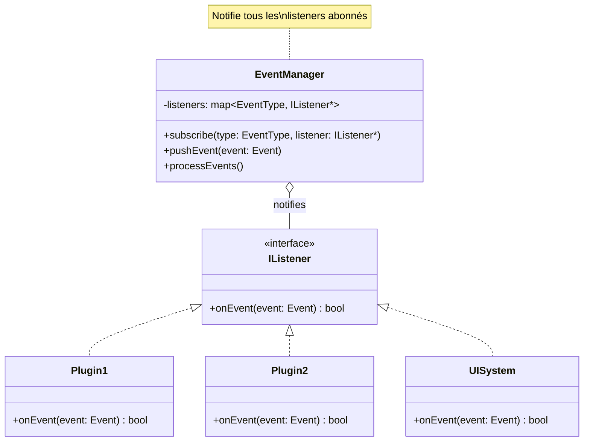
```mermaid
classDiagram
    class EventManager {
        -listeners: map~EventType, IListener*~
        +subscribe(type: EventType, listener: IListener*)
        +pushEvent(event: Event)
        +processEvents()
    }
    
    class IListener {
        <<interface>>
        +onEvent(event: Event) bool
    }
    
    class Plugin1 {
        +onEvent(event: Event) bool
    }
    
    class Plugin2 {
        +onEvent(event: Event) bool
    }
    
    class UISystem {
        +onEvent(event: Event) bool
    }
    
    EventManager o-- IListener : notifies
    IListener <|.. Plugin1
    IListener <|.. Plugin2
    IListener <|.. UISystem
    
    note for EventManager "Notifie tous les\nlisteners abonnés"
```

### Factory Pattern (Plugin Creation)

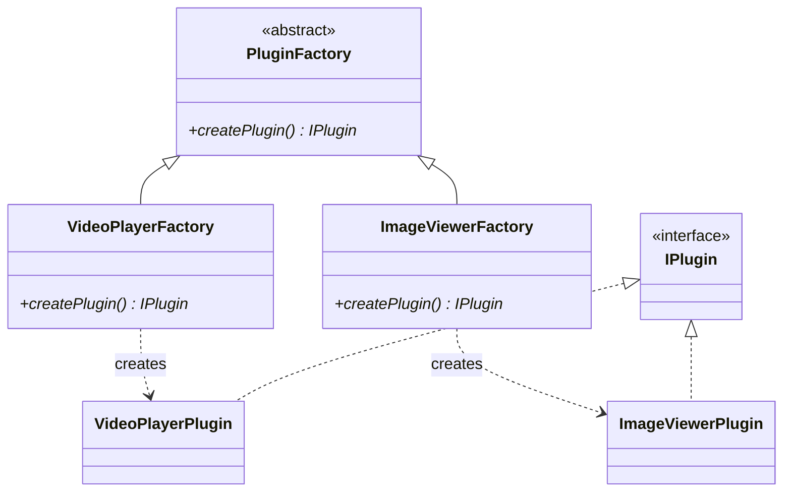
```mermaid
classDiagram
    class PluginFactory {
        <<abstract>>
        +createPlugin() IPlugin*
    }
    
    class VideoPlayerFactory {
        +createPlugin() IPlugin*
    }
    
    class ImageViewerFactory {
        +createPlugin() IPlugin*
    }
    
    class IPlugin {
        <<interface>>
    }
    
    class VideoPlayerPlugin {
    }
    
    class ImageViewerPlugin {
    }
    
    PluginFactory <|-- VideoPlayerFactory
    PluginFactory <|-- ImageViewerFactory
    VideoPlayerFactory ..> VideoPlayerPlugin : creates
    ImageViewerFactory ..> ImageViewerPlugin : creates
    IPlugin <|.. VideoPlayerPlugin
    IPlugin <|.. ImageViewerPlugin
```

---

## 6. Diagramme d'États

### États du Plugin

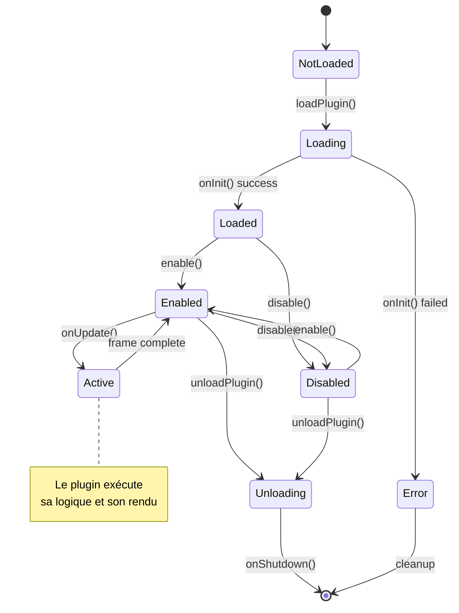
```mermaid
stateDiagram-v2
    [*] --> NotLoaded
    NotLoaded --> Loading : loadPlugin()
    Loading --> Loaded : onInit() success
    Loading --> Error : onInit() failed
    Loaded --> Enabled : enable()
    Loaded --> Disabled : disable()
    Enabled --> Active : onUpdate()
    Active --> Enabled : frame complete
    Enabled --> Disabled : disable()
    Disabled --> Enabled : enable()
    Enabled --> Unloading : unloadPlugin()
    Disabled --> Unloading : unloadPlugin()
    Unloading --> [*] : onShutdown()
    Error --> [*] : cleanup
    
    note right of Active
        Le plugin exécute
        sa logique et son rendu
    end note
```

### États de l'Application

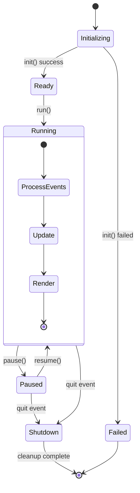
```mermaid
stateDiagram-v2
    [*] --> Initializing
    Initializing --> Ready : init() success
    Initializing --> Failed : init() failed
    Ready --> Running : run()
    Running --> Paused : pause()
    Paused --> Running : resume()
    Running --> Shutdown : quit event
    Paused --> Shutdown : quit event
    Shutdown --> [*] : cleanup complete
    Failed --> [*]
    
    state Running {
        [*] --> ProcessEvents
        ProcessEvents --> Update
        Update --> Render
        Render --> [*]
    }
```

---

## 7. Diagramme de Composants

### Vue d'ensemble du système

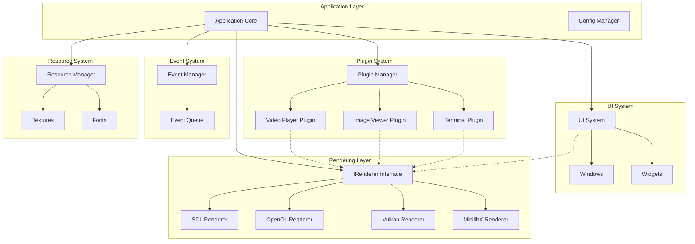
```mermaid
graph TB
    subgraph "Application Layer"
        APP[Application Core]
        CONF[Config Manager]
    end
    
    subgraph "Plugin System"
        PM[Plugin Manager]
        VP[Video Player Plugin]
        IV[Image Viewer Plugin]
        TP[Terminal Plugin]
    end
    
    subgraph "UI System"
        UI[UI System]
        WIN[Windows]
        WID[Widgets]
    end
    
    subgraph "Event System"
        EM[Event Manager]
        QUEUE[Event Queue]
    end
    
    subgraph "Resource System"
        RM[Resource Manager]
        TEX[Textures]
        FONT[Fonts]
    end
    
    subgraph "Rendering Layer"
        IRENDER[IRenderer Interface]
        SDL[SDL Renderer]
        OGL[OpenGL Renderer]
        VK[Vulkan Renderer]
        MLX[MinilibX Renderer]
    end
    
    APP --> PM
    APP --> UI
    APP --> EM
    APP --> RM
    APP --> IRENDER
    
    PM --> VP
    PM --> IV
    PM --> TP
    
    UI --> WIN
    UI --> WID
    
    EM --> QUEUE
    
    RM --> TEX
    RM --> FONT
    
    IRENDER --> SDL
    IRENDER --> OGL
    IRENDER --> VK
    IRENDER --> MLX
    
    VP -.-> IRENDER
    IV -.-> IRENDER
    TP -.-> IRENDER
    
    UI -.-> IRENDER
```

---

## 8. Diagramme de Déploiement

### Architecture runtime

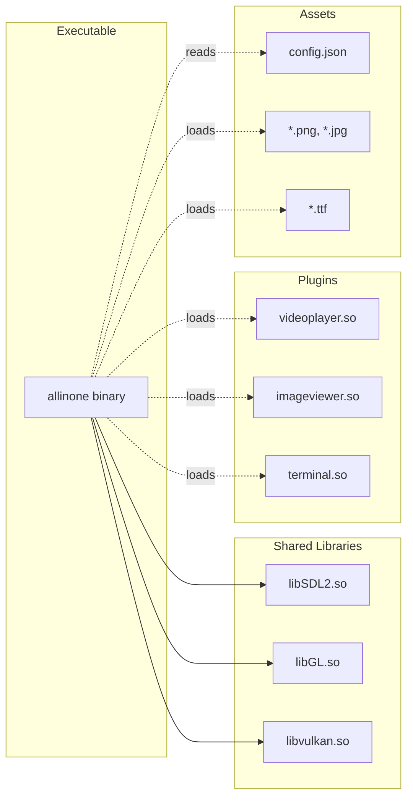
```mermaid
graph LR
    subgraph "Executable"
        MAIN[allinone binary]
    end
    
    subgraph "Shared Libraries"
        SDL_LIB[libSDL2.so]
        GL_LIB[libGL.so]
        VK_LIB[libvulkan.so]
    end
    
    subgraph "Plugins"
        VP_SO[videoplayer.so]
        IV_SO[imageviewer.so]
        TP_SO[terminal.so]
    end
    
    subgraph "Assets"
        CONFIG[config.json]
        TEXTURES[*.png, *.jpg]
        FONTS[*.ttf]
    end
    
    MAIN --> SDL_LIB
    MAIN --> GL_LIB
    MAIN --> VK_LIB
    MAIN -.loads.-> VP_SO
    MAIN -.loads.-> IV_SO
    MAIN -.loads.-> TP_SO
    MAIN -.reads.-> CONFIG
    MAIN -.loads.-> TEXTURES
    MAIN -.loads.-> FONTS
```

---

## 9. Cas d'Usage Visuel

### Ajout d'un nouveau Renderer

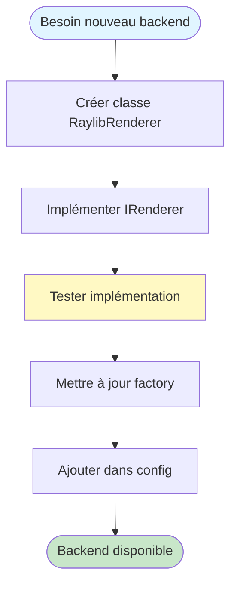
```mermaid
graph TD
    START([Besoin nouveau backend])
    CREATE[Créer classe RaylibRenderer]
    IMPL[Implémenter IRenderer]
    TEST[Tester implémentation]
    UPDATE[Mettre à jour factory]
    CONFIG[Ajouter dans config]
    END([Backend disponible])
    
    START --> CREATE
    CREATE --> IMPL
    IMPL --> TEST
    TEST --> UPDATE
    UPDATE --> CONFIG
    CONFIG --> END
    
    style START fill:#e1f5ff
    style END fill:#c8e6c9
    style TEST fill:#fff9c4
```

### Création d'un Plugin

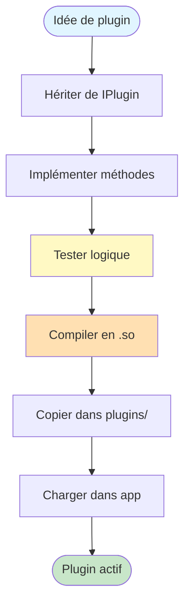
```mermaid
graph TD
    START([Idée de plugin])
    INHERIT[Hériter de IPlugin]
    IMPL[Implémenter méthodes]
    TEST[Tester logique]
    BUILD[Compiler en .so]
    DEPLOY[Copier dans plugins/]
    LOAD[Charger dans app]
    END([Plugin actif])
    
    START --> INHERIT
    INHERIT --> IMPL
    IMPL --> TEST
    TEST --> BUILD
    BUILD --> DEPLOY
    DEPLOY --> LOAD
    LOAD --> END
    
    style START fill:#e1f5ff
    style END fill:#c8e6c9
    style TEST fill:#fff9c4
    style BUILD fill:#ffe0b2
```

---

## 10. Diagramme de Flux de Données

### Flux de rendu complet

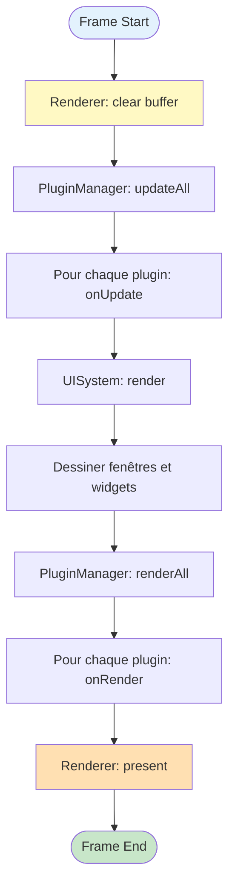
```mermaid
flowchart TD
    START([Frame Start])
    
    CLEAR[Renderer: clear buffer]
    
    UPDATE_PLUGINS[PluginManager: updateAll]
    PLUGIN_UPDATE[Pour chaque plugin: onUpdate]
    
    RENDER_UI[UISystem: render]
    UI_DRAW[Dessiner fenêtres et widgets]
    
    RENDER_PLUGINS[PluginManager: renderAll]
    PLUGIN_RENDER[Pour chaque plugin: onRender]
    
    PRESENT[Renderer: present]
    
    END([Frame End])
    
    START --> CLEAR
    CLEAR --> UPDATE_PLUGINS
    UPDATE_PLUGINS --> PLUGIN_UPDATE
    PLUGIN_UPDATE --> RENDER_UI
    RENDER_UI --> UI_DRAW
    UI_DRAW --> RENDER_PLUGINS
    RENDER_PLUGINS --> PLUGIN_RENDER
    PLUGIN_RENDER --> PRESENT
    PRESENT --> END
    
    style START fill:#e3f2fd
    style END fill:#c8e6c9
    style CLEAR fill:#fff9c4
    style PRESENT fill:#ffe0b2
```

---

## Comment visualiser ces diagrammes ?

### Dans VS Code
1. Installer l'extension **Markdown Preview Mermaid Support**
2. Ouvrir ce fichier et utiliser la prévisualisation Markdown (`Ctrl+Shift+V`)

### Sur GitHub/GitLab
Les diagrammes Mermaid sont nativement supportés et s'affichent automatiquement.

### En ligne
1. Copier le code d'un diagramme
2. Aller sur [mermaid.live](https://mermaid.live)
3. Coller et visualiser

---

## Légende des symboles Mermaid

| Symbole | Signification |
|---------|---------------|
| `<|--` | Héritage / Implémentation |
| `*--` | Composition (losange plein) |
| `o--` | Agrégation (losange vide) |
| `..>` | Dépendance |
| `--` | Association |

---

**Dernière mise à jour :** Janvier 2026  
**Auteur :** Projet AllInOne
