# 📊 Diagrammes UML Visuels - Projet AllInOne

Ce document complète le tutoriel UML principal avec des diagrammes au format Mermaid, optimisés pour la visualisation dans les éditeurs Markdown modernes (VS Code, GitHub, GitLab, etc.).

## Table des Matières
1. [Diagramme de Classes Principal](#1-diagramme-de-classes-principal)
2. [Architecture des Renderers](#2-architecture-des-renderers)
3. [Système de Plugins](#3-système-de-plugins)
4. [Diagrammes de Séquence](#4-diagrammes-de-séquence)
5. [Patterns de Conception](#5-patterns-de-conception)

---

## 1. Diagramme de Classes Principal

### Vue d'ensemble de l'architecture

### Application Core

---

## 2. Architecture des Renderers

### Hiérarchie complète

```mermaid
classDiagram
    class IRenderer {
        <<interface>>
        +init(w: int, h: int) bool
        +shutdown() void
        +clear(color: Color) void
        +present() void
        +drawPixel(x, y: int, color: Color)
        +drawLine(x1, y1, x2, y2: int)
        +drawRect(rect: Rect, color: Color)
        +getSize() Vec2
    }
    
    class SDLRenderer {
        -window: SDL_Window*
        -renderer: SDL_Renderer*
        +init() bool
        +drawPixel() void
    }
    
    class OpenGLRenderer {
        -context: GLContext*
        -shaderProgram: GLuint
        +compileShader() GLuint
    }
    
    class MinilibXRenderer {
        -mlx: void*
        -window: void*
        +mlxPixelPut() void
    }
    
    class VulkanRenderer {
        -instance: VkInstance
        -device: VkDevice
        +createCmdBuffer() void
    }
    
    IRenderer <|.. SDLRenderer
    IRenderer <|.. OpenGLRenderer
    IRenderer <|.. MinilibXRenderer
    IRenderer <|.. VulkanRenderer
    
    note for IRenderer "Interface polymorphique\npermet le changement de backend\nà l'exécution"
```

---

## 3. Système de Plugins

### Architecture des Plugins

```mermaid
classDiagram
    class IPlugin {
        <<interface>>
        +onInit(ctx: PluginContext*) bool
        +onShutdown() void
        +onUpdate(deltaTime: float) void
        +onRender(renderer: IRenderer*) void
        +onEvent(event: Event) bool
        +getName() string
        +getVersion() string
        +isEnabled() bool
    }
    
    class VideoPlayerPlugin {
        -decoder: FFmpegDecoder*
        -currentFrame: Texture*
        -isPlaying: bool
        +loadVideo(path: string) bool
        +play() void
        +pause() void
        +stop() void
    }
    
    class ImageViewerPlugin {
        -image: Texture*
        -zoom: float
        -offset: Vec2
        +loadImage(path: string) bool
        +zoomIn() void
        +zoomOut() void
        +pan(dx: int, dy: int) void
    }
    
    class TerminalPlugin {
        -buffer: vector~string~
        -cursor: Vec2
        -font: Font*
        +executeCommand(cmd: string) void
        +print(text: string) void
        +clear() void
    }
    
    class PluginManager {
        <<Singleton>>
        -plugins: map~string, IPlugin*~
        -loadedLibraries: vector~void*~
        +loadPlugin(path: string) bool
        +unloadPlugin(name: string) bool
        +getPlugin(name: string) IPlugin*
        +updateAll(dt: float) void
        +renderAll(renderer: IRenderer*) void
    }
    
    IPlugin <|.. VideoPlayerPlugin
    IPlugin <|.. ImageViewerPlugin
    IPlugin <|.. TerminalPlugin
    PluginManager *-- IPlugin : manages
    
    note for IPlugin "Chaque plugin est chargé\ndynamiquement (.so/.dll)\nau runtime"
```

### Contexte du Plugin

```mermaid
classDiagram
    class PluginContext {
        +renderer: IRenderer*
        +resourceManager: ResourceManager*
        +eventManager: EventManager*
        +uiSystem: UISystem*
        +getConfig(key: string) string
    }
    
    class IPlugin {
        <<interface>>
        +onInit(ctx: PluginContext*) bool
    }
    
    IPlugin ..> PluginContext : uses
    
    note for PluginContext "Fournit l'accès aux\nsystèmes de l'application\naux plugins"
```

---

## 4. Diagrammes de Séquence

### Séquence d'initialisation

### Game Loop - Cycle de vie

```mermaid
sequenceDiagram
    participant A as Application
    participant EM as EventManager
    participant PM as PluginManager
    participant P as Plugin
    participant R as Renderer
    participant UI as UISystem
    
    loop Chaque frame
        Note over A: 1. Process Events
        A->>EM: processEvents()
        activate EM
        EM->>P: onEvent(event)
        activate P
        P-->>EM: handled?
        deactivate P
        deactivate EM
        
        Note over A: 2. Update
        A->>PM: updateAll(deltaTime)
        activate PM
        loop Pour chaque plugin
            PM->>P: onUpdate(deltaTime)
            activate P
            Note over P: Mise à jour logique
            deactivate P
        end
        deactivate PM
        
        Note over A: 3. Render
        A->>R: clear(Color::Black)
        activate R
        deactivate R
        
        A->>UI: render(renderer)
        activate UI
        Note over UI: Dessine l'UI
        deactivate UI
        
        A->>PM: renderAll(renderer)
        activate PM
        loop Pour chaque plugin
            PM->>P: onRender(renderer)
            activate P
            P->>R: drawRect(...)
            P->>R: drawTexture(...)
            deactivate P
        end
        deactivate PM
        
        A->>R: present()
        activate R
        Note over R: Affiche le frame
        deactivate R
    end
```

### Chargement d'un Plugin

### Gestion d'événements

```mermaid
sequenceDiagram
    participant U as User
    participant B as Button
    participant EM as EventManager
    participant P1 as Plugin 1
    participant P2 as Plugin 2
    participant A as Application
    
    U->>B: Click
    activate B
    B->>EM: pushEvent(BUTTON_CLICKED)
    deactivate B
    
    Note over A: Dans la game loop
    A->>EM: processEvents()
    activate EM
    
    EM->>EM: event = eventQueue.pop()
    
    EM->>P1: onEvent(event)
    activate P1
    P1-->>EM: false (non géré)
    deactivate P1
    
    EM->>P2: onEvent(event)
    activate P2
    Note over P2: Traite l'événement
    P2->>P2: play()
    P2-->>EM: true (géré, stop propagation)
    deactivate P2
    
    deactivate EM
```

---

## 5. Patterns de Conception

### Singleton Pattern

### Strategy Pattern

```mermaid
classDiagram
    class Context {
        -strategy: IRenderer*
        +setRenderer(r: IRenderer*)
        +executeStrategy()
    }
    
    class IRenderer {
        <<interface>>
        +render() void
    }
    
    class SDLRenderer {
        +render() void
    }
    
    class VulkanRenderer {
        +render() void
    }
    
    class OpenGLRenderer {
        +render() void
    }
    
    Context o-- IRenderer : uses
    IRenderer <|.. SDLRenderer
    IRenderer <|.. VulkanRenderer
    IRenderer <|.. OpenGLRenderer
    
    note for Context "Peut changer de stratégie\n(renderer) à l'exécution"
```

### Observer Pattern (EventManager)

### Factory Pattern (Plugin Creation)

---

## 6. Diagramme d'États

### États du Plugin

### États de l'Application

---

## 7. Diagramme de Composants

### Vue d'ensemble du système

---

## 8. Diagramme de Déploiement

### Architecture runtime

---

## 9. Cas d'Usage Visuel

### Ajout d'un nouveau Renderer

```mermaid
graph TD
    START([Besoin nouveau backend])
    CREATE[Créer classe RaylibRenderer]
    IMPL[Implémenter IRenderer]
    TEST[Tester implémentation]
    UPDATE[Mettre à jour factory]
    CONFIG[Ajouter dans config]
    END([Backend disponible])
    
    START --> CREATE
    CREATE --> IMPL
    IMPL --> TEST
    TEST --> UPDATE
    UPDATE --> CONFIG
    CONFIG --> END
    
    style START fill:#e1f5ff
    style END fill:#c8e6c9
    style TEST fill:#fff9c4
```

### Création d'un Plugin

```mermaid
graph TD
    START([Idée de plugin])
    INHERIT[Hériter de IPlugin]
    IMPL[Implémenter méthodes]
    TEST[Tester logique]
    BUILD[Compiler en .so]
    DEPLOY[Copier dans plugins/]
    LOAD[Charger dans app]
    END([Plugin actif])
    
    START --> INHERIT
    INHERIT --> IMPL
    IMPL --> TEST
    TEST --> BUILD
    BUILD --> DEPLOY
    DEPLOY --> LOAD
    LOAD --> END
    
    style START fill:#e1f5ff
    style END fill:#c8e6c9
    style TEST fill:#fff9c4
    style BUILD fill:#ffe0b2
```

---

## 10. Diagramme de Flux de Données

### Flux de rendu complet

```mermaid
flowchart TD
    START([Frame Start])
    
    CLEAR[Renderer: clear buffer]
    
    UPDATE_PLUGINS[PluginManager: updateAll]
    PLUGIN_UPDATE[Pour chaque plugin: onUpdate]
    
    RENDER_UI[UISystem: render]
    UI_DRAW[Dessiner fenêtres et widgets]
    
    RENDER_PLUGINS[PluginManager: renderAll]
    PLUGIN_RENDER[Pour chaque plugin: onRender]
    
    PRESENT[Renderer: present]
    
    END([Frame End])
    
    START --> CLEAR
    CLEAR --> UPDATE_PLUGINS
    UPDATE_PLUGINS --> PLUGIN_UPDATE
    PLUGIN_UPDATE --> RENDER_UI
    RENDER_UI --> UI_DRAW
    UI_DRAW --> RENDER_PLUGINS
    RENDER_PLUGINS --> PLUGIN_RENDER
    PLUGIN_RENDER --> PRESENT
    PRESENT --> END
    
    style START fill:#e3f2fd
    style END fill:#c8e6c9
    style CLEAR fill:#fff9c4
    style PRESENT fill:#ffe0b2
```

---

## Comment visualiser ces diagrammes ?

### Dans VS Code
1. Installer l'extension **Markdown Preview Mermaid Support**
2. Ouvrir ce fichier et utiliser la prévisualisation Markdown (`Ctrl+Shift+V`)

### Sur GitHub/GitLab
Les diagrammes Mermaid sont nativement supportés et s'affichent automatiquement.

### En ligne
1. Copier le code d'un diagramme
2. Aller sur [mermaid.live](https://mermaid.live)
3. Coller et visualiser

---

## Légende des symboles Mermaid

| Symbole | Signification |
|---------|---------------|
| `<|--` | Héritage / Implémentation |
| `*--` | Composition (losange plein) |
| `o--` | Agrégation (losange vide) |
| `..>` | Dépendance |
| `--` | Association |

---

**Dernière mise à jour :** Janvier 2026  
**Auteur :** Projet AllInOne
